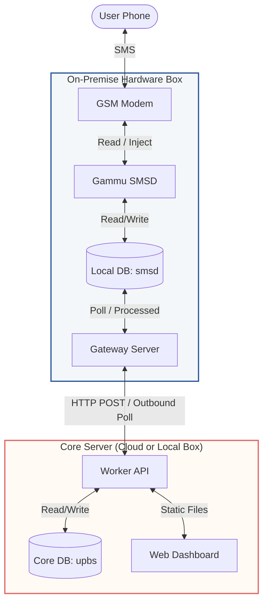

# UP Bikeshare System

The UP Bikeshare System is a student-run, free-to-use bicycle-sharing service designed for the University of the Philippines. This repository houses the backend services and dashboards of the platform.

The system allows registered users to search for available bicycles, query location stations, view usage history, and borrow bicycles directly by sending normalized SMS commands from their mobile phones.

---

## Table of Contents
- [Key Features](#key-features)
- [Directory Structure](#directory-structure)
- [System Architecture](#system-architecture)
- [REST API Reference](#rest-api-reference)
- [Tech Stack](#tech-stack)
- [Local Development & Working Environment](#local-development--working-environment-setup)
- [Deployment Guide & Environment Setup](#deployment-guide--environment-setup)
  - [Scenario A: Single Local Hardware Deployment](#scenario-a-single-local-hardware-deployment-all-in-one)
  - [Scenario B: Hybrid Cloud/Hardware Deployment](#scenario-b-hybrid-cloudhardware-deployment-separated-box)

---

## Key Features

- **Decoupled Microservices**: Separates low-level SMS hardware polling from resource-heavy business logic, preventing modem freeze issues.
- **SMS Command Interface**: Intuitive command parsing allows students to borrow and check bike statuses from any standard mobile phone.
- **Real-Time Map & Dashboards**: Dedicated student and administrator dashboards providing live coordinates and bicycle availability.
- **Trust Score & Dispute Audit**: An automated point-based merit system tracking honest returns and damage reporting, complete with a dispute resolution panel.

---

## Directory Structure

```text
upbs/
├── dashboard/            # Static HTML, CSS, and JS web dashboards
│   ├── index.html        # Public entry / login landing page
│   ├── student-dashboard.html
│   ├── admin-dashboard.html
│   └── js/               # Core application and map logic
├── gateway-server/       # SMS gateway microservice
│   ├── server.js         # Inbox polling and modem integration logic
│   └── db.js             # Local smsd database connection pool
├── worker-api/           # Core API server & business logic
│   ├── server.js         # Entry point for HTTP routing and static serving
│   ├── db.js             # MySQL database migration and pool config
│   ├── recreate_db.js    # One-command database recreation and seeding
│   ├── controllers/      # Route handler implementations
│   ├── routes/           # REST API routing definitions
│   └── services/         # Background cron jobs and outbound SMS queue
└── package.json          # Root scripts for multi-project orchestration
```

## System Architecture

The platform uses a decoupled microservices model to ensure high availability and prevent hardware lockups during heavy database operations.



1. **User Sends SMS**: A user texts a command (e.g. `search all` or `b1eee to vinzons`) to the system's phone number.
2. **Modem Reception**: A physical GSM modem receives the text, and `gammu-smsd` stores it in the local `smsd.inbox` table.
3. **Gateway Polling**: The **Gateway Server** polls the inbox table, parses the command patterns, and forwards them to the **Worker API**.
4. **Business Logic**: The **Worker API** processes database transactions in the core `upbs` database (updates coordinate logs, audits memberships, logs operations) and returns the reply.
5. **Reply Dispatched**: The Gateway Server injects the reply back to the modem using `gammu-smsd-inject` for immediate dispatch back to the user.

---

## REST API Reference

To access protected endpoints, request headers must supply:
1. **JWT Auth**: Header `Authorization: Bearer <JWT_TOKEN>` (obtained via login).
2. **Gateway Auth**: Header `x-gateway-secret: <GATEWAY_SECRET>`.

### Authentication
- **`POST /api/auth/login`**: Login students via phone number.
- **`POST /api/admin/login`**: Login administrators via username and password.

### Student Panel (JWT Auth)
- **`GET /api/student/dashboard`**: Fetch student statistics, current active borrow, logs, and Wall of Honor.
- **`GET /api/student/leaderboards`**: Fetch bi-weekly leaderboard standing stats.

### Public Directory & Stats
- **`GET /api/bicycles`**: Returns all active bicycles and statuses.
- **`GET /api/locations`**: Returns all hubs and map coordinates.
- **`GET /api/history/:bicycleCode`**: Fetch borrowing history logs for a bicycle.
- **`GET /api/analytics`**: Retrieve system-wide analytics and usage statistics.

### SMS Gateway Polling (Gateway Auth)
- **`POST /api/members/check`**: Check if a user is active/registered.
- **`GET /api/gateway/outbound`**: Poll the API for pending outbound SMS queue records.
- **`POST /api/gateway/outbound/:id/sent`**: Callback to mark a pending outbound SMS record as sent.

### Admin Controls (Admin JWT Auth)
- **`GET /api/admin/settings`** / **`POST /api/admin/settings`**: Read and update point rules and settings.
- **`GET /api/admin/members`** / **`POST /api/admin/members`**: List and register/update student accounts.
- **`POST /api/admin/bicycles`**: Register a new bicycle on the network.
- **`POST /api/admin/locations`**: Register a new station hub.
- **`POST /api/admin/resolve-dispute`**: Audit and resolve damage/missing disputes (`verdict`: `guilty`, `innocent`, or `neutral`).
- **`POST /api/admin/override-points`**: Overrides student trust points.
- **`POST /api/admin/bicycles/toggle`**: Locks or unlocks a bicycle.

---

## Tech Stack

- **Runtime**: Node.js (v18+)
- **Framework**: Express.js
- **Database**: MySQL (Split into `smsd` for SMS daemon operations and `upbs` for bike sharing data)
- **Hardware Integration**: Gammu SMSD

---

## Local Development & Working Environment Setup

This section provides a guide to setting up your local machine, understanding the workspace architecture, finding which files to edit for specific tasks, and testing changes locally.

### 1. Prerequisites (Mga Kailangang I-install)
Before starting, ensure you have the following installed on your machine:
*   **Node.js (v18 or higher)**: The JavaScript runtime used to run the servers.
*   **MySQL Server**: For running local databases.
*   **Git**: For version control.
*   **Code Editor (VS Code Recommended)**: With the **Live Server** extension installed (useful for previewing static frontend pages).
*   **Database GUI Tool (Optional)**: [DBeaver](https://dbeaver.io/) or [TablePlus](https://tableplus.com/) to inspect your MySQL databases.

---

### 2. Environment Variables Configuration
Copy the sample config files in both services and input your local MySQL database login credentials.

#### A. Worker API Config
Create a `.env` file in the `worker-api/` directory:
```bash
cp worker-api/.env.example worker-api/.env
```
Ensure the database settings in `worker-api/.env` match your local MySQL settings:
*   `DB_HOST`: `127.0.0.1`
*   `DB_PORT`: `3306`
*   `DB_USER` & `DB_PASSWORD`: Your local MySQL username and password.
*   `DB_NAME`: `upbs`
*   `PORT`: `3001` (Port where the API server will run).

#### B. Gateway Server Config
Create a `.env` file in the `gateway-server/` directory:
```bash
cp gateway-server/.env.example gateway-server/.env
```
Ensure the database settings in `gateway-server/.env` match:
*   `DB_HOST`, `DB_USER`, `DB_PASSWORD`: Matches your local MySQL settings.
*   `DB_NAME`: `smsd` (The SMS Daemon database).
*   `WORKER_URL`: `http://localhost:3001`

---

### 3. Workspace Installation & Setup
Run the commands below from the root of the project to set up the dependencies and seed databases:

```bash
# 1. Install dependencies for all sub-projects at once
npm run install:all

# 2. Recreate the 'upbs' and 'smsd' databases with test seed data
npm run db:recreate
```
*Note: The `npm run db:recreate` script (located at `worker-api/recreate_db.js`) will automatically create the `upbs` and `smsd` databases and fill them with mock membership accounts, active bicycles, parking stations, and system logs.*

---

### 4. How to Run Services Locally
Open two separate terminals in the project root:

*   **Terminal 1 (Worker API)**:
    ```bash
    npm run start:worker
    ```
*   **Terminal 2 (SMS Gateway Server)**:
    ```bash
    npm run start:gateway
    ```

Once running:
*   The API endpoints will be accessible at `http://localhost:3001`.
*   The dashboards are served statically at `http://localhost:3001/` (e.g. `http://localhost:3001/index.html` for login, `/student-dashboard.html` or `/admin-dashboard.html`).

---

### 5. 📂 Where to Edit? (Codebase Reference Map)
When working on a feature or fixing a bug, use the table below to find which files to open:

| If you are modifying... | ...head over to this directory / file | Key files to edit |
| :--- | :--- | :--- |
| **Frontend/Design of Dashboards** <br>*(UI layouts, HTML templates, CSS, forms)* | `dashboard/` | *   `dashboard/index.html`<br>*   `dashboard/student-dashboard.html`<br>*   `dashboard/admin-dashboard.html`<br>*   `dashboard/css/` |
| **Frontend Page Logic & Maps** <br>*(Fetch requests to API, dynamic UI rendering, Leaflet maps)* | `dashboard/js/` | *   `dashboard/js/student.js` (Student portal action logic)<br>*   `dashboard/js/admin-search.js` & `settings.js` (Admin panels)<br>*   `dashboard/js/map.js` (Leaflet coordinates map) |
| **Backend REST API Routes** <br>*(Registering new URL paths or middleware settings)* | `worker-api/routes/` | *   `worker-api/routes/api.js` |
| **Backend Core Business Logic** <br>*(Borrowing/returning algorithms, members validation, admin settings)* | `worker-api/controllers/` | *   `worker-api/controllers/bikeController.js` (Borrow/Return flow)<br>*   `worker-api/controllers/adminController.js` (Admin overrides)<br>*   `worker-api/controllers/memberController.js` (Member retrieval) |
| **Database Schema and Seeds** <br>*(Tables recreation, mock data seeding)* | `worker-api/recreate_db.js` | *   `worker-api/recreate_db.js`<br>*   `worker-api/schema_update.sql` |
| **Background Cron Schedules** <br>*(Late penalties tracking, resetting bi-weekly leaderboards)* | `worker-api/services/` | *   `worker-api/services/cronJobs.js` |
| **SMS Gateway / Modem Interface** <br>*(Modem database polling, parsing incoming SMS commands)* | `gateway-server/` | *   `gateway-server/server.js` |

---

### 6. 🧪 How to Test SMS Commands Locally (Mocking)
You do **not** need a physical GSM USB modem connected to your PC to test the SMS message processing locally. You can mock SMS receipts directly in your database:

1.  Start the worker and gateway services (`npm run start:worker` and `npm run start:gateway`).
2.  Connect to your local MySQL server using a GUI tool (DBeaver, TablePlus, or MySQL Workbench).
3.  Simulate an incoming text by executing this SQL query:
    ```sql
    INSERT INTO smsd.inbox (SenderNumber, TextDecoded, ReceivingDateTime) 
    VALUES ('+639171234567', 'search all', NOW());
    ```
4.  Observe your **Gateway Server** console logs. You should see it capture the text, forward it to the **Worker API**, and receive the text reply.
5.  Inspect the `smsd.outbox` table in your database. You will see the auto-generated response (e.g. `"UP Bikeshare: Active Stations..."`) queued and ready to send.

---

## Deployment Guide & Environment Setup

This project is agnostic and can be deployed under two main environments.

### Scenario A: Single Local Hardware Deployment (All-in-One)
Best for testing or environments where the database, server, and physical GSM modem reside on the same machine.

```
+--------------------------------------------------------------+
|                     SINGLE LOCAL SERVER                      |
|                                                              |
|   +--------------+      +----------------+                   |
|   |  Worker API  | <--- | Gateway Server |                   |
|   |  (Port 3001) |      |  (Port 3000)   |                   |
|   +--------------+      +----------------+                   |
|          |                      |                            |
|          v                      v                            |
|     [MySQL:upbs]           [MySQL:smsd] <--- [Gammu Daemon]  |
|                                                     ^        |
|                                                     |        |
+-----------------------------------------------------|--------+
                                                      v
                                              [GSM USB Dongle]
```

#### Step 1: Install Dependencies
From the root directory:
```bash
npm run install:all
```

#### Step 2: Environment Configuration
1. **Worker API**:
   ```bash
   cp worker-api/.env.example worker-api/.env
   ```
2. **Gateway Server**:
   ```bash
   cp gateway-server/.env.example gateway-server/.env
   ```
   *(Ensure `WORKER_URL` in `gateway-server/.env` is set to `http://localhost:3001`)*

#### Step 3: Recreate & Seed Database
Ensure your local MySQL/MariaDB server is running. Create both `upbs` and `smsd` databases by running:
```bash
npm run db:recreate
```

#### Step 4: Run Services
- In development:
  - Terminal 1: `npm run start:worker`
  - Terminal 2: `npm run start:gateway`
- In production (via **PM2**):
  ```bash
  pm2 start worker-api/server.js --name "upbs-worker"
  pm2 start gateway-server/server.js --name "upbs-gateway"
  pm2 save
  pm2 startup
  ```

---

### Scenario B: Hybrid Cloud/Hardware Deployment (Separated Box)
Recommended for live operations. The databases, Worker API, and frontend dashboards are hosted on a Cloud VPS (e.g., Digital Ocean) for reliability, while the physical GSM modem remains connected to an on-premise hardware box running the Gateway Server.

```
+--------------------------------------------------------------+
|                         CLOUD (VPS)                          |
|                                                              |
|          +--------------+                                    |
|          |  Worker API  | (Public HTTPs Port 3001)            |
|          | & Dashboard  |                                    |
|          +--------------+                                    |
|                 |                                            |
|                 v                                            |
|            [MySQL:upbs]                                      |
+-----------------|--------------------------------------------+
                  ^
                  | (Secured Axios Polling / HTTP POSTs)
+-----------------|--------------------------------------------+
                  v                                            |
|          +---------------+                                   |
|          |Gateway Server | (Port 3000)                       |
|          +---------------+                                   |
|                 |                                            |
|                 v                                            |
|            [MySQL:smsd] <--- [Gammu Daemon]                  |
|                                     ^                        |
|                                     |                        |
|                              [GSM USB Dongle]                |
|                    ON-PREMISE HARDWARE BOX                   |
+--------------------------------------------------------------+
```

#### Step 1: Cloud VPS Deployment (Worker API & Dashboard)
1. Clone this repository on your Cloud VPS (e.g. Digital Ocean Droplet).
2. Install dependencies: `npm run install:all`
3. Configure `worker-api/.env` with your cloud database credentials and set `NODE_ENV=production`.
4. Initialize the cloud database:
   ```bash
   npm run db:recreate
   ```
5. Start the Worker API:
   ```bash
   pm2 start worker-api/server.js --name "upbs-worker"
   ```

#### Step 2: On-Premise Hardware Box Deployment (Gateway Server)
1. Clone this repository on your local hardware box connected to the GSM modem.
2. Install dependencies: `npm run install:all`
3. Configure `gateway-server/.env` to connect `DB_HOST` to your local MySQL running `smsd`.
4. Set `WORKER_URL` to point to your cloud VPS address (e.g. `https://upbs-api.yourdomain.com`).
5. Ensure `GATEWAY_SECRET` and `GATEWAY_API_KEY` match those configured on the Cloud VPS.
6. Install and configure `gammu-smsd` to write incoming SMS to the local `smsd` database.
7. Start the Gateway Server:
   ```bash
   pm2 start gateway-server/server.js --name "upbs-gateway"
   ```
