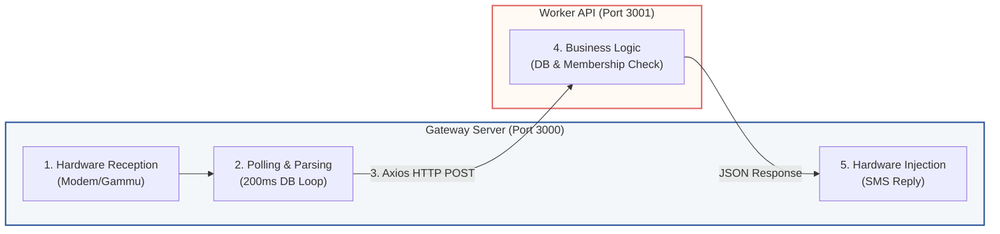

# UP Bikeshare System

This codebase is the backend of the **UP Bike Share System**, a student-run, free-to-use bicycle-sharing service at the University of the Philippines. 

The system allows registered users to search for available bicycles, query location stations, view usage history, and borrow bicycles directly by sending simple, normalized SMS commands from their mobile phones.

---

## 1. System Overview

The UP Bikeshare backend is structured as a decoupled, two-part microservices architecture designed to ensure high availability and reliable SMS-handling operations.

* **The Problem**: The previous monolithic server froze during heavy database queries. Because SMS polling and database/business logic ran in a coupled fashion, database locks/freezes caused the hardware modem to drop incoming texts, resulting in lost user commands.
* **The Solution**: A decoupled **Microservices Architecture** separates the hardware interaction layer from the resource-heavy business logic.
  * **Gateway Server (Port 3000)**: A lightweight Node.js service dedicated strictly to polling the Gammu local database and triggering modem replies. Because it has minimal processing overhead, it remains highly responsive and prevents dropped incoming SMS messages.
  * **Worker API (Port 3001)**: An Express.js REST API that handles all MariaDB/MySQL queries and core business logic in isolation, insulating the modem hardware from database load.

---

## 2. How It Works (High-Level)



1. **User Sends SMS**: A user sends a command (e.g., `search all` or `1 eee to vinzons`) to the system's phone number.
2. **Modem receives SMS**: A physical GSM modem receives the SMS, and `gammu-smsd` (SMS Daemon) reads it and stores it in the local `smsd.inbox` database table.
3. **Gateway Polling**: The **Gateway Server** polls the inbox table, detects the new message, parses the command, and sends it to the **Worker API**.
4. **Business Logic Execution**: The **Worker API** connects to the main `upbs` database, checks the sender's registration, processes the action (like updating bike coordinates or logging transactions), and returns the appropriate text reply.
5. **SMS Sent to User**: The Gateway Server receives the reply from the Worker API and injects it back to the GSM modem in the background using `gammu-smsd-inject`, delivering the response SMS back to the user's phone.

---

## 3. Component Architecture

The codebase is split into two modular services to achieve separation of concerns:

### Gateway Server (`gateway-server`)
- **Port**: `3000`
- **Purpose**: Acts as the SMS-hardware gateway proxy.
- **Key Roles**:
  - Polls the local `smsd` inbox database for unprocessed messages.
  - Normalizes and parses incoming SMS commands.
  - Proxies commands to the Worker API.
  - Interfaces with the physical GSM modem via `gammu-smsd-inject` in a non-blocking background queue to deliver replies.

### Worker API (`worker-api`)
- **Port**: `3001`
- **Purpose**: Houses the core business logic and database interactions.
- **Key Roles**:
  - Checks user membership registration status.
  - Manages bicycle statuses and coordinates in database transactions.
  - Queries active location stations and lists usage histories.
  - Logs transaction histories (`Logs` table) and invalid attempt counters.

---

## 4. API Command Reference

Below is a quick dictionary of the text commands a student can send via SMS and the corresponding Worker API endpoint that processing is routed to:

| User SMS Command Example | Pattern matched by Gateway | Worker API Endpoint | Description |
| :--- | :--- | :--- | :--- |
| `search all` | `search all` (exact) | `POST /api/search-all` | Checks availability of all bicycles across stations. |
| `search b1` | `search <bicycle_code>` | `POST /api/search` | Checks the status and current location of a specific bike. |
| `1 eee to vinzons` | `<bicycle_code> <from> to <to>` | `POST /api/borrow` | Initiates a bicycle borrow transaction. |
| `locations` | `locations` (exact) | `POST /api/locations` | Lists all active stations and the count of bikes at each. |
| `usage b1` | `usage <bicycle_code>` | `POST /api/usage` | Retrieves recent transaction logs for a bike (sent as multiple SMS). |
| `bikeshare help` | `bikeshare help` (exact) | `POST /api/help` | Returns a list of available command instructions. |
| `how` | `how` (exact) | `POST /api/how` | Returns guidelines on how the bike share system works. |

### Fallback & Exception Behaviors

1. **Invalid Commands (`POST /api/invalid-command`)**
   * *Trigger*: If an incoming text message does not match any of the regex patterns, the Gateway Server routes it to `/api/invalid-command`.
   * *Outcome*: Returns a generic response advising the user of the error and suggesting they text `"bikeshare help"` for list of commands.
2. **Invalid Bicycle Code during Borrow**
   * *Trigger*: When a borrow transaction matching the syntactic pattern is submitted, but the specified bicycle does not exist in the database.
   * *Outcome*: The Worker API returns `{ invalidBicycle: true }`. The Gateway detects this and forwards the sender payload to `/api/invalid-command` asynchronously to dispatch the warning SMS.
3. **Unregistered Senders (`POST /api/non-registered`)**
   * *Trigger*: In protected flows (such as `/api/borrow`), the system checks the sender's mobile number against the `Members` table.
   * *Outcome*: If the sender is unregistered, the route response triggers a warning notification advising them to sign up before using the service.
4. **Worker API Outage & Recovery**
   * *Trigger*: If the Worker API server is down or returns a network error (e.g., 502/504 Bad Gateway, timeouts).
   * *Outcome*: The Gateway Server logs the error but **does not** update `Processed = 'true'` in the local `inbox` table. The message remains locked/unread, allowing the Gateway to retry processing it automatically once connection to the Worker API is restored.

---

## Tech Stack
- **Runtime**: Node.js
- **Framework**: Express.js
- **Database**: MySQL (split into `smsd` for SMS daemon and `upbs` for bike sharing data)
- **Hardware Interface**: Gammu (via SMSD)

---

## Running Locally

### 1. Worker API (Business Logic)
Starts on **Port 3001**.
```bash
cd worker-api
npm install
node server.js
```

### 2. Gateway Server (SMS Handling)
Starts on **Port 3000**.
*Note: Ensure your Gammu daemon is running and configured to point to this server.*
```bash
cd gateway-server
npm install
node server.js
```

### 3. Production (PM2)
To run both services simultaneously on a server:
```bash
pm2 start gateway-server/server.js --name "upbs-gateway"
pm2 start worker-api/server.js --name "upbs-worker"
pm2 save
pm2 startup
```
