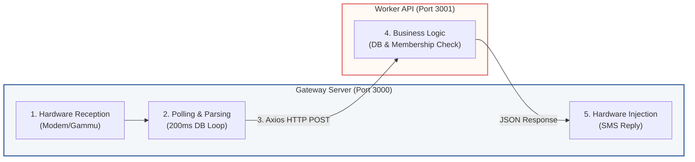

# UP Bikeshare System

This codebase is the backend of the **UP Bike Share System**, a student-run, free-to-use bicycle-sharing service at the University of the Philippines. 

The system allows registered users to search for available bicycles, query location stations, view usage history, and borrow bicycles directly by sending simple, normalized SMS commands from their mobile phones.

---

## 1. System Overview

The UP Bikeshare backend is structured as a decoupled, two-part microservices architecture designed to ensure high availability and reliable SMS-handling operations.

* **The Problem**: The previous monolithic server froze during heavy database queries. Because SMS polling and database/business logic ran in a coupled fashion, database locks/freezes caused the hardware modem to drop incoming texts, resulting in lost user commands.
* **The Solution**: A decoupled **Microservices Architecture** separates the hardware interaction layer from the resource-heavy business logic.
  * **Gateway Server (Port 3000)**: A lightweight Node.js service dedicated strictly to polling the Gammu local database and triggering modem replies. Because it has minimal processing overhead, it remains highly responsive and prevents dropped incoming SMS messages.
  * **Worker API (Port 3001)**: An Express.js REST API that handles all MariaDB/MySQL queries and core business logic in isolation, insulating the modem hardware from database load.

---

## 2. How It Works (High-Level)



1. **User Sends SMS**: A user sends a command (e.g., `search all` or `1 eee to vinzons`) to the system's phone number.
2. **Modem receives SMS**: A physical GSM modem receives the SMS, and `gammu-smsd` (SMS Daemon) reads it and stores it in the local `smsd.inbox` database table.
3. **Gateway Polling**: The **Gateway Server** polls the inbox table, detects the new message, parses the command, and sends it to the **Worker API**.
4. **Business Logic Execution**: The **Worker API** connects to the main `upbs` database, checks the sender's registration, processes the action (like updating bike coordinates or logging transactions), and returns the appropriate text reply.
5. **SMS Sent to User**: The Gateway Server receives the reply from the Worker API and injects it back to the GSM modem in the background using `gammu-smsd-inject`, delivering the response SMS back to the user's phone.

---

## 3. Component Architecture

The codebase is split into two modular services to achieve separation of concerns:

### Gateway Server (`gateway-server`)
- **Port**: `3000`
- **Purpose**: Acts as the SMS-hardware gateway proxy.
- **Key Roles**:
  - Polls the local `smsd` inbox database for unprocessed messages.
  - Normalizes and parses incoming SMS commands.
  - Proxies commands to the Worker API.
  - Interfaces with the physical GSM modem via `gammu-smsd-inject` in a non-blocking background queue to deliver replies.

### Worker API (`worker-api`)
- **Port**: `3001`
- **Purpose**: Houses the core business logic and database interactions.
- **Key Roles**:
  - Checks user membership registration status.
  - Manages bicycle statuses and coordinates in database transactions.
  - Queries active location stations and lists usage histories.
  - Logs transaction histories (`Logs` table) and invalid attempt counters.

---

## 4. API Command Reference

Below is a quick dictionary of the text commands a student can send via SMS and the corresponding Worker API endpoint that processing is routed to:

| User SMS Command Example | Pattern matched by Gateway | Worker API Endpoint | Description |
| :--- | :--- | :--- | :--- |
| `search all` | `search all` (exact) | `POST /api/search-all` | Checks availability of all bicycles across stations. |
| `search b1` | `search <bicycle_code>` | `POST /api/search` | Checks the status and current location of a specific bike. |
| `1 eee to vinzons` | `<bicycle_code> <from> to <to>` | `POST /api/borrow` | Initiates a bicycle borrow transaction. |
| `locations` | `locations` (exact) | `POST /api/locations` | Lists all active stations and the count of bikes at each. |
| `usage b1` | `usage <bicycle_code>` | `POST /api/usage` | Retrieves recent transaction logs for a bike (sent as multiple SMS). |
| `bikeshare help` | `bikeshare help` (exact) | `POST /api/help` | Returns a list of available command instructions. |
| `how` | `how` (exact) | `POST /api/how` | Returns guidelines on how the bike share system works. |

### Fallback & Exception Behaviors

1. **Invalid Commands (`POST /api/invalid-command`)**
   * *Trigger*: If an incoming text message does not match any of the regex patterns, the Gateway Server routes it to `/api/invalid-command`.
   * *Outcome*: Returns a generic response advising the user of the error and suggesting they text `"bikeshare help"` for list of commands.
2. **Invalid Bicycle Code during Borrow**
   * *Trigger*: When a borrow transaction matching the syntactic pattern is submitted, but the specified bicycle does not exist in the database.
   * *Outcome*: The Worker API returns `{ invalidBicycle: true }`. The Gateway detects this and forwards the sender payload to `/api/invalid-command` asynchronously to dispatch the warning SMS.
3. **Unregistered Senders (`POST /api/non-registered`)**
   * *Trigger*: In protected flows (such as `/api/borrow`), the system checks the sender's mobile number against the `Members` table.
   * *Outcome*: If the sender is unregistered, the route response triggers a warning notification advising them to sign up before using the service.
4. **Worker API Outage & Recovery**
   * *Trigger*: If the Worker API server is down or returns a network error (e.g., 502/504 Bad Gateway, timeouts).
   * *Outcome*: The Gateway Server logs the error but **does not** update `Processed = 'true'` in the local `inbox` table. The message remains locked/unread, allowing the Gateway to retry processing it automatically once connection to the Worker API is restored.

---

## Tech Stack
- **Runtime**: Node.js
- **Framework**: Express.js
- **Database**: MySQL (split into `smsd` for SMS daemon and `upbs` for bike sharing data)
- **Hardware Interface**: Gammu (via SMSD)

---

## Deployment Guide & Environment Setup

This repository is designed to be highly agnostic. Depending on your needs, you can deploy the UPBS system in one of two main scenarios.

### Scenario A: Single Local Hardware Deployment (All-in-One)
In this scenario, all services (Worker API + Dashboard, Gateway Server, and Gammu SMSD) run on a single local hardware machine (e.g. an office server, desktop, or Raspberry Pi) directly connected to the physical GSM modem.

```
+--------------------------------------------------------------+
|                     SINGLE LOCAL SERVER                      |
|                                                              |
|   +--------------+      +----------------+                   |
|   |  Worker API  | <--- | Gateway Server |                   |
|   |  (Port 3001) |      |  (Port 3000)   |                   |
|   +--------------+      +----------------+                   |
|          |                      |                            |
|          v                      v                            |
|     [MySQL:upbs]           [MySQL:smsd] <--- [Gammu Daemon]  |
|                                                     ^        |
|                                                     |        |
+-----------------------------------------------------|--------+
                                                      v
                                              [GSM USB Dongle]
```

#### Step 1: Clone and Install Dependencies
From the repository root directory, run the helper command to install dependencies in both microservices:
```bash
npm run install:all
```

#### Step 2: Environment Configuration
1. **Worker API**: Copy `worker-api/.env.example` to `worker-api/.env` and adjust variables.
   ```bash
   cp worker-api/.env.example worker-api/.env
   ```
2. **Gateway Server**: Copy `gateway-server/.env.example` to `gateway-server/.env` and adjust variables.
   ```bash
   cp gateway-server/.env.example gateway-server/.env
   ```
   *Note: In Scenario A, `WORKER_URL` in `gateway-server/.env` should point to `http://localhost:3001`.*

#### Step 3: Recreate & Seed Database
Ensure you have a local MySQL/MariaDB server running. To automatically drop, recreate, and seed both the `upbs` and `smsd` databases from scratch, run this single command:
```bash
npm run db:recreate
```
*(Optionally, if your MySQL requires root privileges to create databases, configure `DB_ROOT_USER` and `DB_ROOT_PASSWORD` in `worker-api/.env` first).*

#### Step 4: Run the Services
To start both servers in development:
* In terminal 1: `npm run start:worker`
* In terminal 2: `npm run start:gateway`

For production daemon management, use **PM2**:
```bash
pm2 start worker-api/server.js --name "upbs-worker"
pm2 start gateway-server/server.js --name "upbs-gateway"
pm2 save
pm2 startup
```

---

### Scenario B: Hybrid Cloud/Hardware Deployment (Separated Box)
In this scenario, the database, Worker API, and Admin/Student Dashboard are deployed in the cloud (e.g. Digital Ocean Droplet) for high availability, while the physical GSM modem remains connected to a local hardware box (e.g., Raspberry Pi) running only the Gateway Server and Gammu.

```
+--------------------------------------------------------------+
|                         CLOUD (VPS)                          |
|                                                              |
|          +--------------+                                    |
|          |  Worker API  | (Public HTTPs Port 3001)            |
|          | & Dashboard  |                                    |
|          +--------------+                                    |
|                 |                                            |
|                 v                                            |
|            [MySQL:upbs]                                      |
+-----------------|--------------------------------------------+
                  ^
                  | (Secured Axios Polling / HTTP POSTs)
+-----------------|--------------------------------------------+
                  v                                            |
|          +---------------+                                   |
|          |Gateway Server | (Port 3000)                       |
|          +---------------+                                   |
|                 |                                            |
|                 v                                            |
|            [MySQL:smsd] <--- [Gammu Daemon]                  |
|                                     ^                        |
|                                     |                        |
|                              [GSM USB Dongle]                |
|                    ON-PREMISE HARDWARE BOX                   |
+--------------------------------------------------------------+
```

#### Step 1: Cloud VPS Deployment (Worker API & Dashboard)
1. Clone this repository on your Cloud VPS (e.g. Digital Ocean Droplet).
2. Install dependencies: `npm run install:all`
3. Configure `worker-api/.env` with your cloud database credentials. Set `NODE_ENV=production`.
4. Initialize the cloud database (only `upbs` is needed in the cloud, but the script will create both):
   ```bash
   npm run db:recreate
   ```
5. Start the Worker API using PM2:
   ```bash
   pm2 start worker-api/server.js --name "upbs-worker"
   ```

#### Step 2: On-Premise Hardware Box Deployment (Gateway Server)
1. Clone this repository on your local hardware box (connected to the GSM modem).
2. Install dependencies: `npm run install:all`
3. Configure `gateway-server/.env`. Connect `DB_HOST` to your local MySQL (which runs `smsd` for Gammu).
4. Set `WORKER_URL` to point to your cloud VPS address (e.g., `https://upbs-api.yourdomain.com`).
5. Ensure `GATEWAY_SECRET` and `GATEWAY_API_KEY` match those configured on the Cloud VPS.
6. Install and configure `gammu-smsd` to write incoming SMS to the local `smsd` database.
7. Start the Gateway Server using PM2:
   ```bash
   pm2 start gateway-server/server.js --name "upbs-gateway"
   ```

### Why this Decoupled Architecture is Robust:
1. **Prevention of Hardware Lockups**: Heavy database reporting queries do not run on the local hardware box, ensuring `gammu-smsd` never drops incoming SMS.
2. **Network Interruption Tolerance**: If internet connection to the Cloud VPS is temporarily lost, incoming SMS remain safe in the local `smsd.inbox` table as unread. The local Gateway Server will automatically resume routing them once connection is restored.
3. **Outbound SMS Queueing**: The Worker API writes all system notification/reminder SMS to the `outbound_sms` table in the cloud. The local Gateway Server polls this endpoint every 5 seconds, downloads the messages, sends them using the local modem, and marks them as sent in the cloud.

